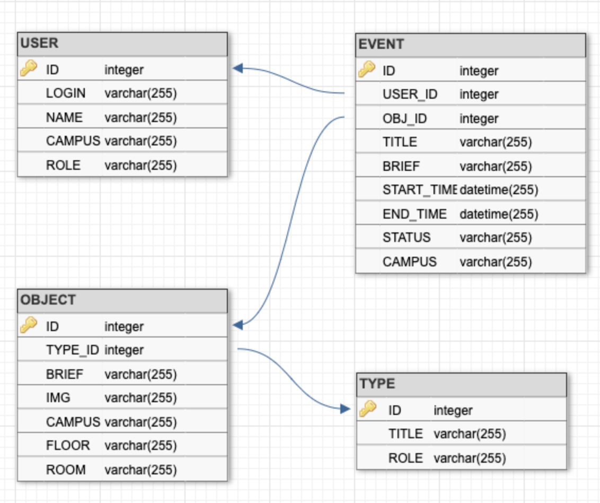

## 2.5. Формализация сущностей предметной области

#### Формируем предворительную базу данных под `MySql`

``` sql
 CREATE TABLE `TYPE` (
	`ID` INT NOT NULL AUTO_INCREMENT,
	`TITLE` varchar(255) NOT NULL,
	`ROLE` varchar(255) NOT NULL,
	PRIMARY KEY (`ID`)
);

CREATE TABLE `OBJECT` (
	`ID` INT NOT NULL AUTO_INCREMENT,
	`TYPE_ID` INT NOT NULL,
	`BRIEF` varchar(255) NOT NULL,
	`IMG` varchar(255),
	`CAMPUS` varchar(255) NOT NULL,
	`FLOOR` varchar(255) NOT NULL,
	`ROOM` varchar(255) NOT NULL,
	PRIMARY KEY (`ID`)
);

CREATE TABLE `EVENT` (
	`ID` INT NOT NULL AUTO_INCREMENT,
	`USER_ID` INT NOT NULL,
	`OBJ_ID` INT NOT NULL,
	`TITLE` varchar(255) NOT NULL,
	`BRIEF` varchar(255),
	`START_TIME` DATETIME(255) NOT NULL,
	`END_TIME` DATETIME(255) NOT NULL,
	`STATUS` varchar(255) NOT NULL,
	`CAMPUS` varchar(255) NOT NULL,
	PRIMARY KEY (`ID`)
);

CREATE TABLE `USER` (
	`ID` INT NOT NULL AUTO_INCREMENT,
	`LOGIN` varchar(255) NOT NULL,
	`NAME` varchar(255) NOT NULL,
	`CAMPUS` varchar(255) NOT NULL,
	`ROLE` varchar(255) NOT NULL,
	PRIMARY KEY (`ID`)
);

ALTER TABLE `OBJECT` ADD CONSTRAINT `OBJECT_fk0` FOREIGN KEY (`TYPE_ID`) REFERENCES `TYPE`(`ID`);

ALTER TABLE `EVENT` ADD CONSTRAINT `EVENT_fk0` FOREIGN KEY (`USER_ID`) REFERENCES `USER`(`ID`);

ALTER TABLE `EVENT` ADD CONSTRAINT `EVENT_fk1` FOREIGN KEY (`OBJ_ID`) REFERENCES `OBJECT`(`ID`);
```
#### В графическом виде будет представлена в таком виде:

